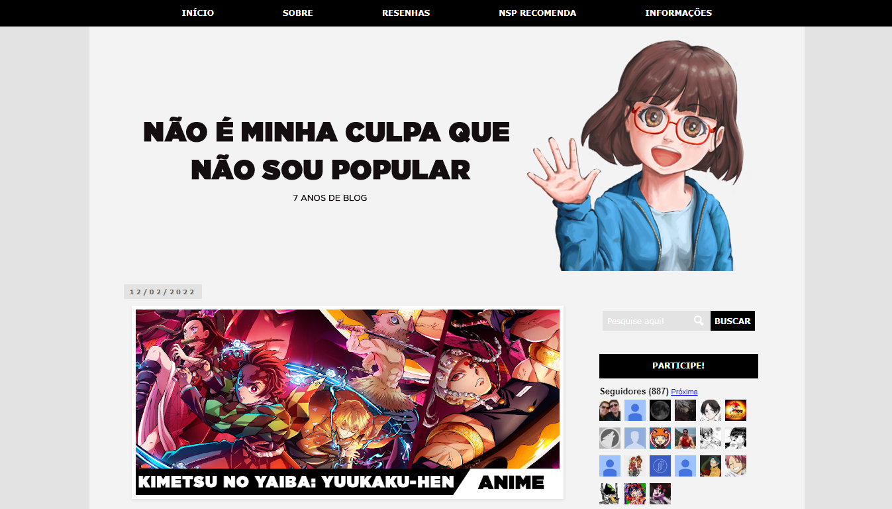

<h3 align="center">
    :heavy_check_mark:Página modelo do Blog Não é minha culpa que não sou popular
</h3>

## 🔖 Informações
<ul>
    <li>Página inicial com apresentação, últimas postagens, links e conteúdo da autora.</li>
    <li>🖱️ <a href="https://marceloisidorio.github.io/nsp-blogger/" target="_blank">Clique aqui</a> para acessar o site.</li>
    <li>Confira também o <a href="http://naoeminhaculpaquenaosoupopular.blogspot.com">Blog Oficial</a></li>
</ul>

## 🖼 Screenshot do site original
</img>
## Tecnologias utilizadas

<a href="https://developer.mozilla.org/pt-BR/docs/Web/HTML" target="_blank">
    
</a>

<a href="https://developer.mozilla.org/pt-BR/docs/Web/CSS" target="_blank">
    
</a>

### :memo: Sobre
- Destaca o cabeçalho com menu e apresentação da marca
- Exibe as últimas postagens publicadas
- Possui barra de pesquisa
- Contém barra lateral com conteúdos periféricos
- Aside inferior e footer no fim da página
- Efeitos em links e caixas
# :hammer_and_wrench: Como rodar localmente

```bash
# Clone o repositório
$ git clone https://github.com/marceloisidorio/nsp-blogger.git

# Acesse a pasta do projeto

# Execute o arquivo "index.html" no navegador de sua preferência
```

## :pushpin: Como contruibuir
- Faça um fork desse repositório.
- Cria uma branch com a sua feature: `git checkout -b minha-feature`
- Faça commit das suas alterações: `git commit -m 'feat: Minha nova feature'`
- Faça push para a sua branch: `git push origin minha-feature`
- Depois que o merge da sua *pull request* for feito, você pode deletar a sua *branch*

## :mortar_board: Autores
<table align="center">
    <tr>
        <td align="center" style="margin: 15px;">
            <a href="https://github.com/marceloisidorio">
                
                <br>
                <sub><b>Marcelo Isidorio</b></sub>
            </a>
        </td>
        <td align="center">
            <a href="https://linktr.ee/naosoupopularrr">
                
                <br>
                <sub><b>Mônica</b></sub>
            </a>
        </td>
    </tr>
</table>